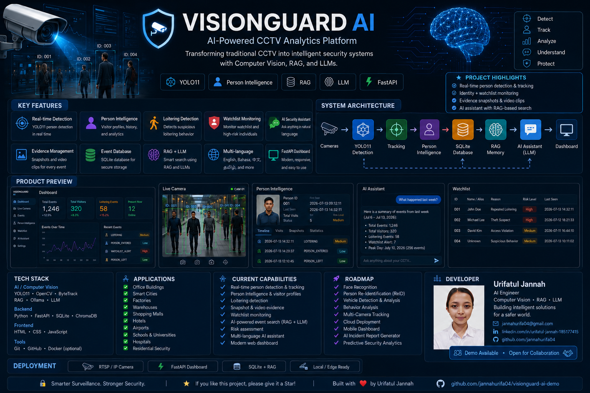

# VisionGuard AI



**VisionGuard AI** is an AI-powered CCTV monitoring and incident intelligence prototype built to transform camera footage into searchable events, evidence, alerts, and natural-language answers.

## Demo

[Watch the VisionGuard AI demo](./demo_clip.mp4)

The public demo includes a sample dashboard with:

- Live camera monitoring
- Person detection and tracking
- Loitering alerts
- Watchlist monitoring
- Evidence snapshots
- Event history
- AI-assisted CCTV questions

## Core Capabilities

### Computer Vision

- Person detection using YOLO
- Multi-object tracking with ByteTrack
- Face recognition
- Person Re-Identification
- Stable permanent person IDs
- Clothing-color analysis
- Person entered, present, left, and loitering events

### Incident Intelligence

- Automatic event logging
- Evidence snapshots and video clips
- Watchlist alerts
- Person profiles
- Searchable incident history
- Risk-level classification

### AI Assistant

The AI Assistant can answer questions such as:

- What happened today?
- Who loitered?
- Tell me about Person ID 11.
- Show the latest evidence.
- Who was wearing a black shirt?

## System Architecture

```text
Camera Feed
    ↓
YOLO Person Detection
    ↓
ByteTrack Tracking
    ↓
Face Recognition + Person ReID
    ↓
Event Detection
    ↓
SQLite Evidence Storage
    ↓
RAG + LLM Intelligence
    ↓
FastAPI Dashboard and AI Assistant
